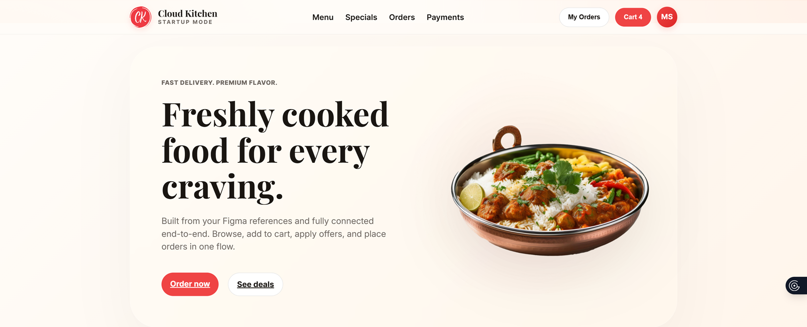
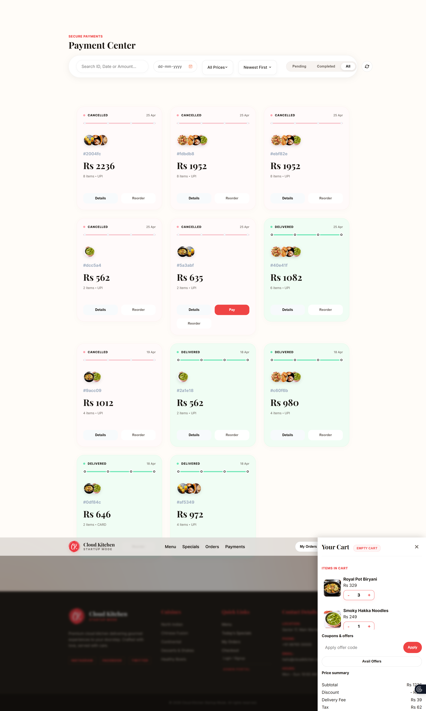
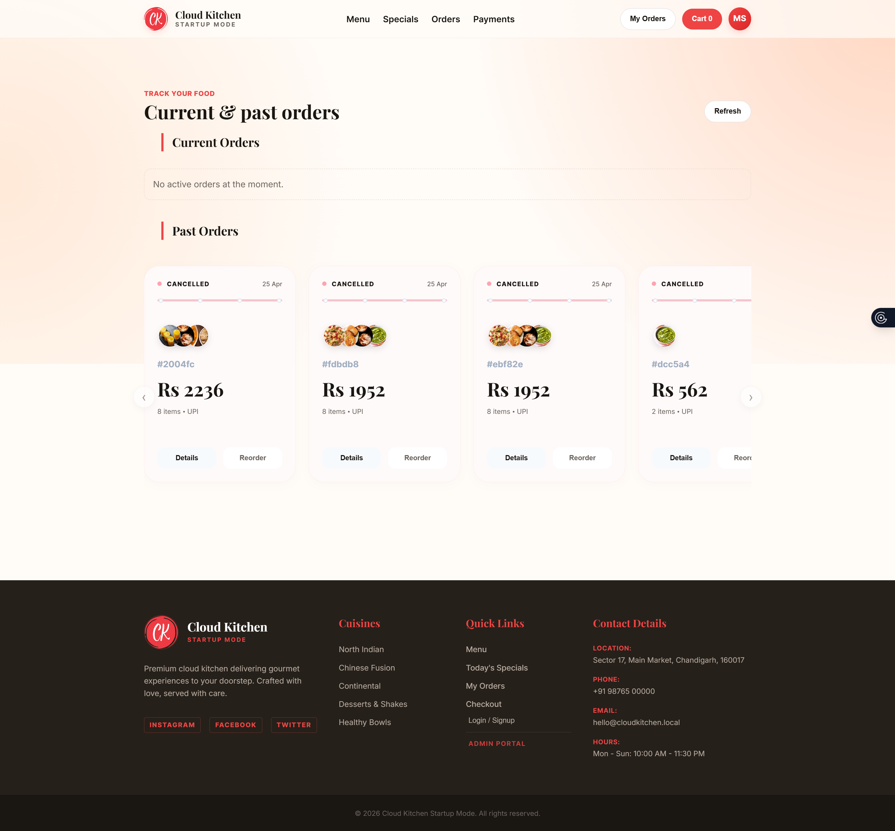
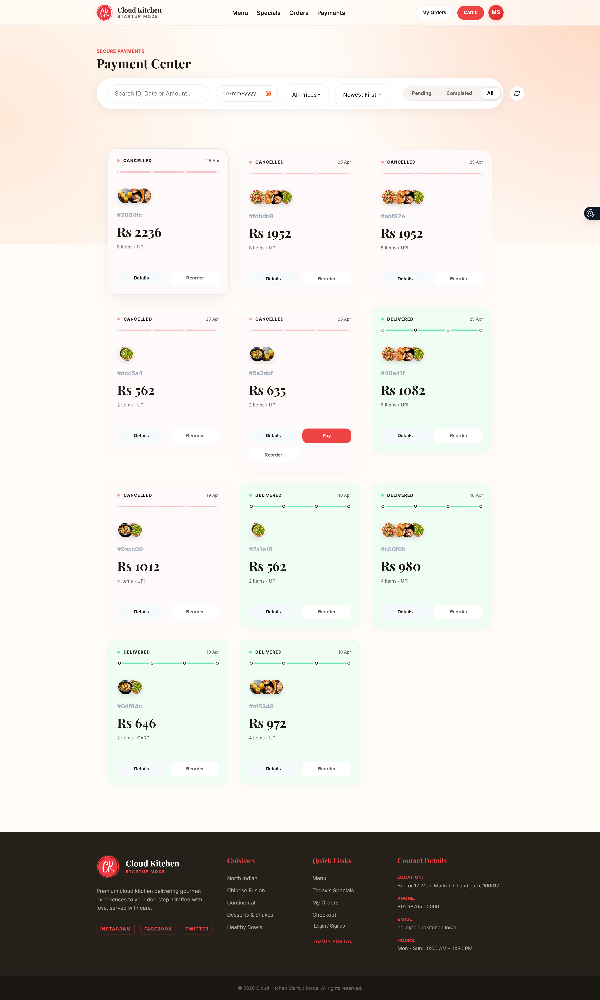
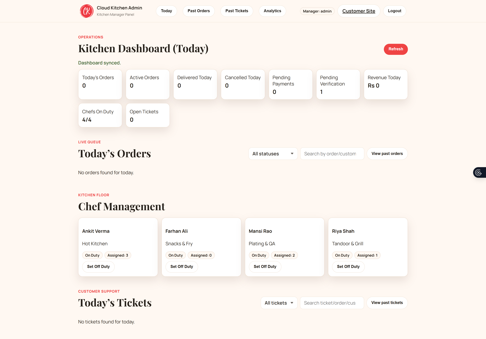
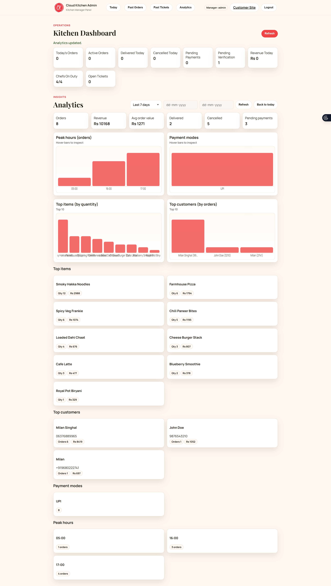
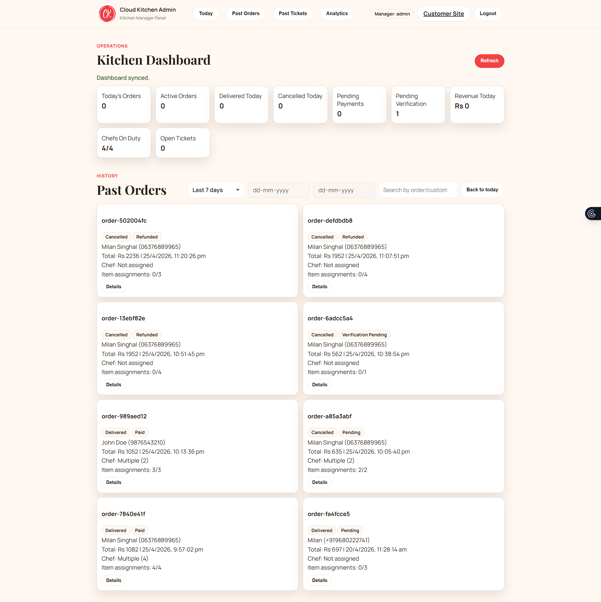

# 🍔 Cloud Kitchen Management Dashboard



A modern, full-stack **Direct-to-Consumer (D2C)** food technology platform designed to empower independent **cloud kitchens**. Reclaim your margins by replacing third-party dependencies with a premium, self-hosted ordering system and a robust **restaurant management suite**.

> **Production-ready** full-stack platform featuring a high-conversion customer ordering website and an advanced Admin/Manager portal to manage chefs, orders, payments, and business analytics in one unified system.

### 🌟 Key Highlights

- **Direct-to-Consumer (D2C)**: Reclaim 25-30% revenue lost to delivery platforms.
- **Full-Stack & Production Ready**: End-to-end solution from ordering to delivery.
- **Unified Management**: One dashboard to manage chefs, live orders, and payments.
- **Business Intelligence**: Deep-dive analytics for revenue, products, and customers.
- **Real-Time Efficiency**: Instant status updates powered by Server-Sent Events (SSE).


## 🌐 Live Demo

Experience the platform live: [cloudkitchenstartup.netlify.app](https://cloudkitchenstartup.netlify.app/)

## 🚀 The Vision

Most cloud kitchens lose 25-30% revenue to delivery platforms. **Cloud Kitchen Startup Mode** is built to reclaim that margin by providing a high-conversion ordering experience and a professional-grade kitchen management suite. It aims to be the "Shopify for Cloud Kitchens."

## ✨ Key Features

### 🛒 Premium Customer Experience

- **Glassmorphism UI**: A stunning, modern design language that builds brand trust and increases conversion.
- **Dynamic Menu**: Real-time search, category filtering, and "Today's Special" highlights.
- **Smart Checkout**: Integrated offer code engine, delivery fee calculation, and automated tax processing.
- **Live Order Tracking**: Real-time status updates (Confirmed → Preparing → Out for Delivery) powered by **Server-Sent Events (SSE)**.

### 👨‍🍳 Pro Kitchen Operations (Admin)

- **Live Kitchen Queue**: A real-time management pane to track every active order without refreshing.
- **Chef Management System**: Monitor "Kitchen Floor" activity, track chef duty status, and manage workload.
- **Operations KPIs**: Instant visibility into today's revenue, active orders, and kitchen efficiency.
- **Support Ticket System**: Integrated threaded communication for handling customer queries effectively.

### 📊 Business Intelligence & Analytics

- **Revenue Analytics**: Deep-dive into financial performance with custom date-range scoping.
- **Product Insights**: Identify top-selling items and high-performing categories.
- **Customer Analytics**: Track repeat orders and customer lifetime value (LTV) through phone-based tracking.

## 🛠️ Technical Excellence

- **Dual-Mode Backend**: Unique architecture supporting both high-performance **PostgreSQL** for production and lightweight **JSON storage** for rapid prototyping.
- **Real-time Engine**: Built-in SSE implementation for instant push notifications from the kitchen to the customer.
- **Responsive Architecture**: Fully optimized for mobile-first ordering and desktop-first management.

| Layer | Technology |
| :--- | :--- |
| **Frontend** | React, Vanilla CSS (Glassmorphism), Vite |
| **Backend** | Node.js, Express.js |
| **Database** | PostgreSQL (Production), JSON Flat-file (Proto) |
| **Real-time** | Server-Sent Events (SSE) |
| **Deployment** | Netlify (Frontend), Render (Backend) |

## 📸 Screenshots

### 🛍️ Customer Ordering Experience

A high-conversion, mobile-responsive storefront featuring a modern glassmorphism design.

<table width="100%">
  <tr>
    <td width="33%"></td>
    <td width="33%"></td>
    <td width="33%"></td>
  </tr>
  <tr>
    <td width="33%"></td>
    <td width="33%"></td>
    <td width="33%"></td>
  </tr>
</table>

### 👨‍💼 Admin Management Portal

The command center for kitchen managers, providing deep insights into operations and performance.

<table width="100%">
  <tr>
    <td width="33%"></td>
    <td width="33%"></td>
    <td width="33%"></td>
  </tr>
</table>

<p align="center">
  <b>⭐ If you like this project, consider starring the repository to support its development!</b>
</p>

## 🛠️ Installation & Setup

1. **Clone & Install**:

   ```bash
   git clone https://github.com/milansinghal2004/cloud-kitchen-management-dashboard.git
   cd cloud-kitchen-management-dashboard
   npm install
   ```

2. **Configure Environment**:
   Create a `.env` file based on `.env.example`.

   ```env
   PORT=3000
   DATABASE_URL=your_postgres_url
   ADMIN_USERNAME=manager
   ADMIN_PASSWORD=manager123
   ```

3. **Start Development**:
   - For JSON Mode: `npm start`
   - For PostgreSQL Mode: `npm run start:db`

## 🔮 Future Roadmap

- [ ] **AI Demand Forecasting**: Predicting order surges using historical data.
- [ ] **Automated Marketing**: Integrated SMS/WhatsApp marketing for re-engaging past customers.
- [ ] **Inventory Management**: Automated stock alerts and ingredient level tracking.
- [ ] **Multi-Outlet Support**: Manage multiple kitchen locations from a single master dashboard.

## 🤝 Contributing

Contributions are what make the open source community such an amazing place to learn, inspire, and create. Any contributions you make are **greatly appreciated**.

1. Fork the Project
2. Create your Feature Branch (`git checkout -b feature/AmazingFeature`)
3. Commit your Changes (`git commit -m 'Add some AmazingFeature'`)
4. Push to the Branch (`git push origin feature/AmazingFeature`)
5. Open a Pull Request

## 📄 License

Distributed under the MIT License. See `LICENSE` for more information.

## 👤 Author

<p align="center">
  
  <br/>
  <b>Milan Singhal</b><br/>
  <i>AI/ML Engineer, Designer & Automobile Enthusiast</i>
</p>

<p align="center">
  <a href="https://portfolio-milansinghal.netlify.app/">
    
  </a>
  <a href="https://github.com/milansinghal2004">
    
  </a>
  <a href="https://linkedin.com/in/milansinghal">
    
  </a>
  <a href="mailto:singhalmilan92@gmail.com">
    
  </a>
</p>

---

### 🏷️ Project Topics

`Cloud Kitchen` • `Food Delivery` • `Restaurant Admin` • `Real-time SSE` • `React.js` • `Node.js` • `PostgreSQL` • `Glassmorphism` • `D2C Tech` • `Ghost Kitchen`
